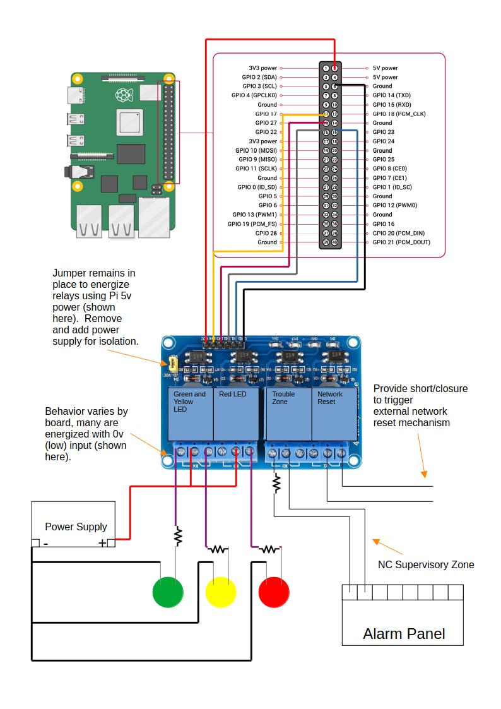

# Raspberry Pi Network Alarm: Dry Contact Output and Supervision

---

This is a hardware project designed primarily to monitor external internet access via the Pi's network interface and conditionally trigger GPIO pins.
It has been deployed on [DietPi](https://dietpi.com/) using a Raspberry Pi 3 B+.

By incorporating a relay module, the Pi can interact with a traditional alarm system and other peripherals.
An ideal situation would be an unmonitored alarm system that only sounds off locally.

---
**If interfacing with a live alarm system, ensure that you have permission to do so.  
A network outage SHOULD NOT trigger an active alarm, but rather only a supervision/trouble/log signal. 
False alarms can result in fines from local authorities**

**This Project is not responsible for any damage that occurs due to improper wiring configuration or failure to safely handle electronic components.**

**This Project is not responsible for any consequences that arise from false alarms. 
Do not interface with a live alarm system unless you fully understand the potential consequences.**
---

## Getting Started

### Hardware

Please reference the following diagram:
(Image Credit: [raspberrypi.com](https://www.raspberrypi.com/documentation/computers/raspberry-pi.html#gpio))



The system is designed to trigger 4 different Form C relays via a few common GPIO pins, though it's possible to include fewer or more.

**Employ appropriate resistors for any peripherals that require them.**

The 4th relay (optional) will provide an output to an external device, such as a modem power supply.
This could allow your network to "self-heal" in situations where a modem power cycle restores internet access.

**However, the network reset mechanism will also trigger if the system is powered down or rebooted, so ensure that you incorporate adequate bypass, shunt, or timing logic to prevent undesirable service interruptions when using reset functionality.**

During normal operation, the green LED will be illuminated, and the supervisory zone will show closed.
Upon failure to request the designated external webpage(s) after N (60) seconds, the supervisory zone will fault and the yellow LED will illuminate as the green LED darkens.

After the designated X failures (10), the red LED will illuminate and the reset output will trigger for Y (15) seconds and then restore.
Every additional X failures will result in another reset output trigger.

_In practice, this should detect an internet outage around one minute and reset the modem every 10 minutes or so if internet access is not restored.  These are rough numbers since natural delays for timeouts will exist._

Summary of operations based on default values:

| System State | Relay 4 (G/Y LED)       | Relay 3 (R LED)         | Relay 2 (Alarm Zone)   | Relay 1 (Reset Output)                      |
|--------------|-------------------------|-------------------------|------------------------|---------------------------------------------|
| Powered Down | De-Energized (Y LED On) | De-Energized (R LED On) | De-Energized (Faulted) | De-Energized (Shorted)                      |
| Normal       | Energized (G LED On)    | Energized (R LED Off)   | Energized (Normal)     | Energized (Normal)                          |
| 1-9 Failures | De-Energized (Y LED On) | Energized (R LED Off)   | De-Energized (Open)    | Energized (Normal)                          |
| 10 Failures  | De-Energized (Y LED On) | De-Energized (R LED On) | De-Energized (Open)    | De-Energized(Short, 15 seconds then Normal) |

___

### Code

Beyond the standard Python library, this project will require `requests`.  A GPIO library might be installed by default on your OS. 
If using Dietpi, you can install a GPIO package via `dietpi-software`.  This project invokes the older import statement `import RPi.GPIO as GPIO`, to attempt compatibility with more systems.  Please amend as needed.

Install `requests` system-wide.

```bash
sudo apt update
sudo apt install python3-requests -y
```

Copy the `net_alarm.py` to a desired folder and modify the variables if needed. 

You can start the program via:
```bash
python3 /path/to/script/net_alarm.py
```
OR:

Run as a service. Update the system specific settings. 
Access to gpio will be needed, so it is recommended to designate a non-root user/group.

```bash
sudo nano /etc/systemd/system/net_alarm.service

# network_alarm.service
[Unit]
Description=GPIO Network Alarm
After=network.target
Wants=gpiod.service
After=gpiod.service

[Service]
ExecStart=/usr/bin/python3 -u /path/to/script/net_alarm.py # update path/to/script
WorkingDirectory=/path/to/script/ # update to script directory
StandardOutput=journal
StandardError=journal
Restart=always
RestartSec=5

User=root # update to non-root user if needed
Group=root # update to non-root group if needed

[Install]
WantedBy=multi-user.target

```
Reload/Enable/Start

```bash
# Reload systemd to register service
sudo systemctl daemon-reload

# Enable on boot
sudo systemctl enable net_alarm.service

# Start immediately
sudo systemctl start net_alarm.service
```

---
### Supervision

You might want to supervise the program itself to ensure that it is performing periodic checks.
[Uptime-Kuma](https://github.com/louislam/uptime-kuma) is a highly recommended monitoring system with a lot of great functionality.
Once installed, you can create a "Push" device which accepts requests to a generated url.  
If you provide this url to the network alarm program under the variable `uptime_kuma_push_url`, it will send a heartbeat with every periodic internet check.

### Logging
Set `VERBOSE` to True for additional logging messages if needed.